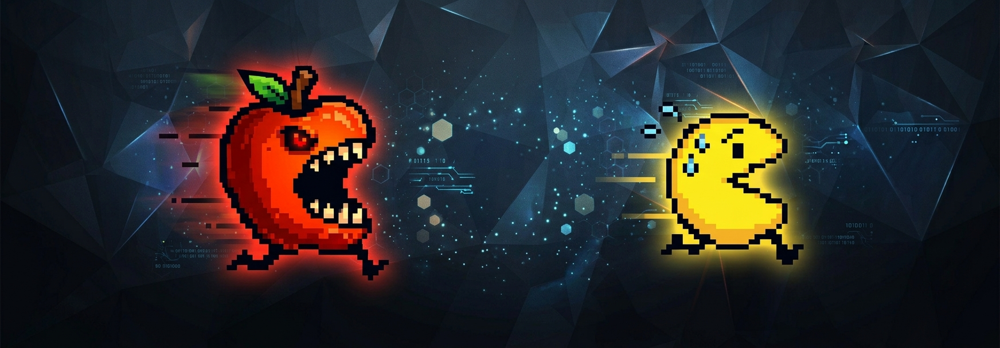
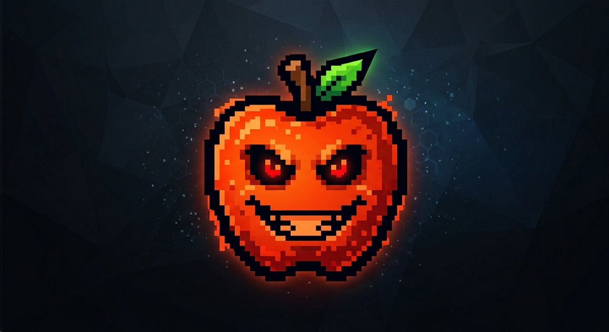
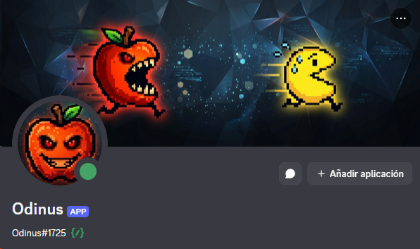



  

  

<h1 align="center">Odinus</h1>

  Asistente de Discord desarrollado en Python por <strong>0D1N SOFTWARE</strong>.

Odinus es una herramienta modular para administrar, automatizar y facilitar tareas
dentro de comunidades de Discord. Su arquitectura permite incorporar progresivamente
nuevos sistemas propios desde un mismo bot.

## Funciones actuales

Odinus cuenta actualmente con sistemas para:

* Administración de canales y mensajes.
* Publicación de mensajes mediante canales seleccionados.
* Perfiles visuales de miembros.
* Sistema de niveles y experiencia.
* Recompensas por nivel mediante roles.
* Registro y seguimiento de cumpleaños.
* Seguimiento automático de invitaciones.
* Autoroles de países.
* Autoroles de edad.
* Consulta de redes sociales de Black Tibii.

## Comandos

### 👤 Comandos para usuarios

* `/ping` — Comprueba que Odinus está activo.
* `/ayuda` — Muestra los comandos disponibles.
* `/redes` — Muestra las redes sociales de Black Tibii.
* `/perfil [usuario]` — Muestra el perfil visual de un miembro.
* `/nivel [usuario]` — Consulta el nivel, experiencia y progreso de un miembro.
* `/cumpleaños registrar` — Registra una fecha de cumpleaños.
* `/cumpleaños lista` — Consulta los cumpleaños registrados del servidor.

Los sistemas de autoroles de país y edad son utilizados por los miembros
mediante los botones publicados por los administradores.

### 🛠️ Comandos para administradores

#### Administración

* `/publicar` — Publica un mensaje en un canal seleccionado.
* `/clear` — Elimina mensajes recientes del canal.
* `/slowmode` — Configura el modo lento del canal.

#### Cumpleaños

* `/cumpleaños configurar_canal` — Configura el canal donde se publicarán los avisos de cumpleaños.

#### Invitaciones

* `/invitaciones configurar_canal` — Configura el canal para el seguimiento de invitaciones y entradas de miembros.

#### Autoroles

* `/paises` — Configura y publica el selector de autoroles de países.
* `/edad` — Configura y publica el selector de autoroles de edad.

#### Niveles

* `/niveles activar` — Activa la obtención automática de experiencia.
* `/niveles desactivar` — Desactiva la obtención automática de experiencia.
* `/nivel_administrar` — Abre el panel para administrar manualmente el nivel y la experiencia de un miembro.

#### Recompensas

* `/recompensa añadir` — Añade una recompensa de nivel.
* `/recompensa editar` — Edita una recompensa configurada.
* `/recompensa eliminar` — Elimina una recompensa configurada.
* `/recompensa lista` — Muestra las recompensas configuradas.

Las recompensas utilizan roles de Discord y se sincronizan automáticamente
con los cambios de nivel.

## Centro de anuncios

El Centro de anuncios está reservado para integraciones propias de Odin Software.

Las próximas integraciones serán:

* **Minecraft** — Comunicación y eventos relacionados con el servidor de Minecraft.
* **BlackTibii.com** — Comunicación entre el sitio web de Black Tibii y Odinus.

Estas integraciones serán desarrolladas directamente por 0D1N SOFTWARE,
evitando depender de APIs externas de redes sociales para el funcionamiento
principal del bot.

## Sistemas automáticos

### 🎂 Cumpleaños

Odinus puede publicar automáticamente los cumpleaños registrados en el canal
configurado. Los avisos se procesan diariamente a medianoche utilizando la
zona horaria de Ciudad de México.

### 📩 Invitaciones

Odinus mantiene un seguimiento de las invitaciones del servidor.

El sistema registra las invitaciones, detecta las entradas de nuevos miembros
cuando es posible identificar la invitación utilizada y mantiene estadísticas
persistentes de invitaciones por usuario.

### ⭐ Niveles

Cuando el sistema está activado, los mensajes de los miembros pueden generar
experiencia automáticamente.

Al alcanzar nuevos niveles, Odinus puede anunciar el ascenso y sincronizar
las recompensas configuradas para ese nivel.

### 🏆 Recompensas

Las recompensas de nivel están asociadas a roles de Discord. Cuando un miembro
cambia de nivel, Odinus sincroniza automáticamente los roles correspondientes.

## Vista previa

  

## Ecosistema Odin

Odinus forma parte de la visión de **0D1N SOFTWARE** de desarrollar herramientas
propias, modulares y conectadas entre sí.

La arquitectura del proyecto está diseñada para incorporar progresivamente
sistemas propios e integraciones controladas directamente por el ecosistema Odin.

## Desarrollo

Odinus se encuentra en desarrollo activo. Este repositorio documenta su evolución
y las capacidades incorporadas al proyecto.

---

  <strong>0D1N SOFTWARE</strong> 
  <em>Construyendo herramientas. Creando un ecosistema.</em>

