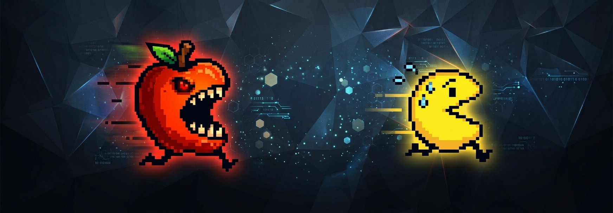
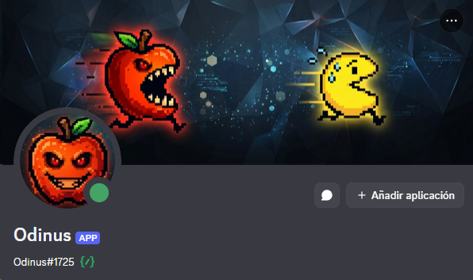



  

  

<h1 align="center">Odinus</h1>

  Asistente de Discord desarrollado en Python por <strong>0D1N SOFTWARE</strong>.

Odinus es una herramienta modular para administrar, automatizar y facilitar tareas
dentro de comunidades de Discord. Su arquitectura permite incorporar progresivamente
nuevos sistemas propios desde un mismo bot.

## Funciones actuales

Odinus cuenta actualmente con sistemas para:

* Administración de canales y mensajes.
* Publicación de mensajes mediante canales seleccionados.
* Información y gestión del servidor.
* Perfiles visuales de miembros.
* Sistema de niveles y experiencia.
* Recompensas por nivel mediante roles.
* Registro y seguimiento de cumpleaños.
* Seguimiento automático de invitaciones.
* Autoroles de países.
* Autoroles de edad.
* Consulta de redes sociales de Black Tibii.
* Sistema completo de moderación manual.
* Sistema propio de AutoMod.
* Registros privados de moderación.
* Excepciones de moderación por canales y roles.
* Palabras bloqueadas configurables.
* Protección contra diferentes tipos de spam y comportamiento repetitivo.

## Comandos

### 👤 Comandos para usuarios

* `/ping` — Comprueba que Odinus está activo.
* `/ayuda` — Muestra los comandos disponibles.
* `/redes` — Muestra las redes sociales de Black Tibii.
* `/server info` — Muestra la información del servidor.
* `/perfil [usuario]` — Muestra el perfil visual de un miembro.
* `/nivel [usuario]` — Consulta el nivel, experiencia y progreso de un miembro.
* `/cumpleaños registrar` — Registra una fecha de cumpleaños.
* `/cumpleaños lista` — Consulta los cumpleaños registrados del servidor.

Los sistemas de autoroles de país y edad son utilizados por los miembros
mediante los botones publicados por los administradores.

### 🛠️ Comandos para administradores

#### Administración

* `/publicar` — Publica un mensaje en un canal seleccionado.
* `/clear` — Elimina mensajes recientes del canal.
* `/slowmode` — Configura el modo lento del canal.

#### Moderación

* `/moderacion configurar` — Configura el canal privado de registros y activa el sistema de moderación.
* `/moderacion canal` — Cambia el canal utilizado para los registros de moderación.
* `/moderacion estado` — Muestra el estado actual del sistema de moderación.
* `/moderacion ignorar_canal` — Añade un canal a las excepciones de moderación.
* `/moderacion quitar_canal` — Elimina un canal de las excepciones de moderación.
* `/moderacion ignorar_rol` — Añade un rol a las excepciones de moderación.
* `/moderacion quitar_rol` — Elimina un rol de las excepciones de moderación.
* `/moderacion warn` — Registra una advertencia para un miembro.
* `/moderacion warnings` — Consulta las advertencias registradas de un miembro.
* `/moderacion modlogs` — Consulta el historial de acciones de moderación.
* `/moderacion timeout` — Aplica un timeout temporal a un miembro.
* `/moderacion mute` — Aplica una sanción de silencio.
* `/moderacion unmute` — Retira una sanción de silencio.
* `/moderacion kick` — Expulsa a un miembro del servidor.
* `/moderacion ban` — Banea a un miembro del servidor.
* `/moderacion unban` — Retira el baneo de un usuario.
* `/moderacion automod` — Configura las reglas automáticas de moderación.
* `/moderacion panel` — Abre el panel interactivo de administración de moderación.

#### Servidor

* `/server configurar` — Configura el sistema de información del servidor.
* `/server activar` — Activa el sistema de información del servidor.
* `/server desactivar` — Desactiva el sistema de información del servidor.

#### Cumpleaños

* `/cumpleaños configurar_canal` — Configura el canal donde se publicarán los avisos de cumpleaños.

#### Invitaciones

* `/invitaciones configurar_canal` — Configura el canal para el seguimiento de invitaciones y entradas de miembros.

#### Autoroles

* `/paises` — Configura y publica el selector de autoroles de países.
* `/edad` — Configura y publica el selector de autoroles de edad.

#### Niveles

* `/niveles activar` — Activa la obtención automática de experiencia.
* `/niveles desactivar` — Desactiva la obtención automática de experiencia.
* `/nivel_administrar` — Abre el panel para administrar manualmente el nivel y la experiencia de un miembro.

#### Recompensas

* `/recompensa añadir` — Añade una recompensa de nivel.
* `/recompensa editar` — Edita una recompensa configurada.
* `/recompensa eliminar` — Elimina una recompensa configurada.
* `/recompensa lista` — Muestra las recompensas configuradas.

Las recompensas utilizan roles de Discord y se sincronizan automáticamente
con los cambios de nivel.

## Sistema de moderación

Odinus incorpora un sistema completo de moderación diseñado para centralizar
las herramientas administrativas y automatizar la detección de comportamientos
problemáticos dentro del servidor.

El sistema incluye:

* Moderación manual.
* Advertencias.
* Historial de acciones de moderación.
* Timeout.
* Mute y unmute.
* Kick.
* Ban y unban.
* Registros privados de moderación.
* Canales ignorados.
* Roles ignorados.
* Palabras bloqueadas.
* AutoMod configurable.
* Acciones automáticas configurables.
* Umbrales configurables.
* Ventanas de tiempo configurables.
* Duraciones de timeout configurables.
* Cooldown para acciones automáticas.

### Configuración

`/moderacion configurar`

Permite configurar el canal privado donde Odinus registrará las acciones
de moderación y activar el sistema.

`/moderacion canal`

Permite cambiar posteriormente el canal utilizado para los registros.

`/moderacion estado`

Muestra el estado actual del sistema de moderación.

### Excepciones

Odinus permite excluir canales y roles específicos del sistema de moderación.

`/moderacion ignorar_canal`

Añade un canal a la lista de canales ignorados.

`/moderacion quitar_canal`

Elimina un canal de la lista de canales ignorados.

`/moderacion ignorar_rol`

Añade un rol a la lista de roles ignorados.

`/moderacion quitar_rol`

Elimina un rol de la lista de roles ignorados.

Estas excepciones permiten mantener fuera de las reglas automáticas determinados
canales o roles cuando sea necesario.

### Moderación manual

`/moderacion warn`

Registra una advertencia para un miembro.

`/moderacion warnings`

Consulta las advertencias registradas de un miembro.

`/moderacion modlogs`

Consulta el historial de acciones de moderación realizadas por Odinus.

`/moderacion timeout`

Aplica un timeout temporal a un miembro.

`/moderacion mute`

Aplica una sanción de silencio.

`/moderacion unmute`

Retira una sanción de silencio.

`/moderacion kick`

Expulsa a un miembro del servidor.

`/moderacion ban`

Banea a un miembro del servidor.

`/moderacion unban`

Retira el baneo de un usuario.

Las acciones de moderación respetan los permisos y la jerarquía de roles
correspondiente de Discord.

### Registros

Las acciones de moderación pueden registrarse automáticamente en un canal
privado configurado por el administrador.

Los registros permiten conservar información relacionada con:

* Usuario afectado.
* Moderador.
* Acción realizada.
* Motivo.
* Duración cuando corresponde.
* Fecha y hora.
* Acciones generadas automáticamente por AutoMod.

## AutoMod

Odinus incorpora un sistema propio de AutoMod configurable por servidor.

Cada regla puede configurarse individualmente mediante:

* Activación o desactivación.
* Acción.
* Umbral.
* Ventana de tiempo.
* Duración del timeout.

Las acciones automáticas disponibles son:

* Eliminar mensaje.
* Advertir.
* Aplicar timeout.

### Reglas de AutoMod

#### Anti-flood

Detecta mensajes idénticos enviados repetidamente por un mismo usuario.

Configuración predeterminada:

* 5 mensajes repetidos.
* Ventana deslizante de 60 segundos.

La ventana es deslizante y no depende de los límites exactos de un minuto.

#### Caracteres repetidos

Detecta 15 o más caracteres idénticos consecutivos dentro de un mismo mensaje.

#### Signos de interrogación repetidos

Detecta 15 o más signos `?` consecutivos.

#### Signos de exclamación repetidos

Detecta 15 o más signos `!` consecutivos.

#### Invitaciones de Discord

Detecta invitaciones de Discord dentro de los mensajes cuando la regla está
activada.

#### Enlaces sospechosos

Detecta enlaces considerados sospechosos por el sistema de moderación.

#### Spam de menciones

Controla las menciones repetidas realizadas por un mismo usuario.

La configuración predeterminada activa la regla al alcanzar 4 menciones del
mismo usuario o rol dentro de una ventana deslizante de 60 segundos.

#### Spam de @everyone y @here

Controla el uso repetido de menciones globales.

La configuración predeterminada activa la regla al alcanzar 4 usos dentro de
una ventana deslizante de 60 segundos.

#### Spam de emojis

Detecta 10 o más emojis repetidos dentro de un mismo mensaje.

#### Palabras bloqueadas

Permite configurar una lista propia de palabras que serán detectadas
automáticamente por Odinus.

### Mensajes largos y multilínea

Los mensajes largos o con varias líneas **no son considerados infracciones
por su longitud o formato**.

Odinus no elimina un mensaje simplemente porque sea extenso, contenga muchas
líneas o esté estructurado en varios párrafos.

Esto permite utilizar mensajes largos para documentación, explicaciones,
anuncios y conversaciones normales.

### Panel de moderación

`/moderacion panel`

Abre el panel interactivo de administración del sistema de moderación.

Desde el panel se pueden administrar:

* Activación y desactivación del sistema.
* Canal de registros.
* Canales ignorados.
* Roles ignorados.
* Palabras bloqueadas.
* Reglas de AutoMod.
* Activación de cada regla.
* Acción de cada regla.
* Umbral.
* Ventana temporal.
* Duración de timeout.
* Restauración de valores predeterminados.
* Estado general de moderación.

El panel utiliza botones, selectores y modales interactivos de Discord.

Todas las operaciones administrativas del panel requieren permisos de
administrador.

## Centro de anuncios

El Centro de anuncios está reservado para integraciones propias de Odin Software.

Las próximas integraciones serán:

* **Minecraft** — Comunicación y eventos relacionados con el servidor de Minecraft.
* **BlackTibii.com** — Comunicación entre el sitio web de Black Tibii y Odinus.

Estas integraciones serán desarrolladas directamente por 0D1N SOFTWARE,
evitando depender de APIs externas de redes sociales para el funcionamiento
principal del bot.

## Sistemas automáticos

### 🎂 Cumpleaños

Odinus puede publicar automáticamente los cumpleaños registrados en el canal
configurado. Los avisos se procesan diariamente a medianoche utilizando la
zona horaria de Ciudad de México.

### 📩 Invitaciones

Odinus mantiene un seguimiento de las invitaciones del servidor.

El sistema registra las invitaciones, detecta las entradas de nuevos miembros
cuando es posible identificar la invitación utilizada y mantiene estadísticas
persistentes de invitaciones por usuario.

### ⭐ Niveles

Cuando el sistema está activado, los mensajes de los miembros pueden generar
experiencia automáticamente.

Al alcanzar nuevos niveles, Odinus puede anunciar el ascenso y sincronizar
las recompensas configuradas para ese nivel.

### 🏆 Recompensas

Las recompensas de nivel están asociadas a roles de Discord. Cuando un miembro
cambia de nivel, Odinus sincroniza automáticamente los roles correspondientes.

### 🛡️ Moderación y AutoMod

Odinus puede analizar automáticamente los mensajes de los miembros cuando el
sistema de moderación se encuentra activo.

El AutoMod puede detectar:

* Flood.
* Mensajes repetidos.
* Caracteres repetidos.
* Signos de interrogación repetidos.
* Signos de exclamación repetidos.
* Invitaciones de Discord.
* Enlaces sospechosos.
* Spam de menciones.
* Spam de `@everyone` y `@here`.
* Spam de emojis.
* Palabras bloqueadas.

Las reglas utilizan ventanas temporales deslizantes cuando corresponde y
cuentan con cooldown para evitar la ejecución repetitiva de acciones
automáticas sobre el mismo usuario y regla.

## Vista previa

  

## Ecosistema Odin

Odinus forma parte de la visión de **0D1N SOFTWARE** de desarrollar herramientas
propias, modulares y conectadas entre sí.

La arquitectura del proyecto está diseñada para incorporar progresivamente
sistemas propios e integraciones controladas directamente por el ecosistema Odin.

## Desarrollo

Odinus se encuentra en desarrollo activo. Este repositorio documenta su evolución
y las capacidades incorporadas al proyecto.

---

  <strong>0D1N SOFTWARE</strong> 
  <em>Construyendo herramientas. Creando un ecosistema.</em>

